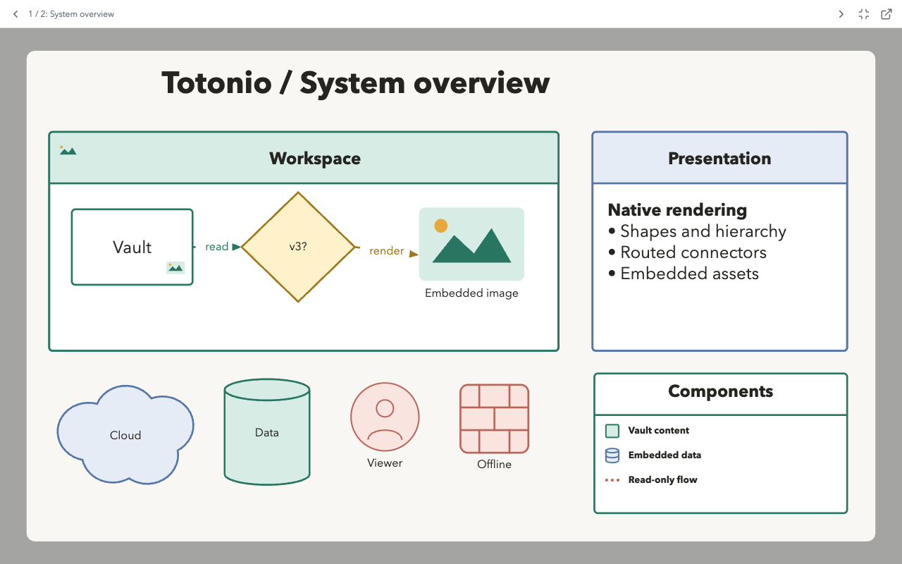

# Totonio Presentation for Obsidian

**Architecture and sequence diagrams alongside your notes. Create in Totonio, present in Obsidian.**

Create in [Totonio's web app](https://totonio.pages.dev/), save a `.totonio` file in your vault, then inspect it, step through Presentation Frames, or embed a preview in Markdown. This plugin is a native, offline, read-only viewer, not an editor.



## Why Totonio Here?

- **Explain a system one frame at a time.** Keep the whole diagram in one file and use ordered Presentation Frames for architecture walkthroughs, process reviews, and meeting notes.
- **Put the diagram beside the explanation.** Embed a compact preview in a design note or open the full diagram in an Obsidian workspace tab.
- **Inspect structure and detail.** View nested containers, routed connectors, labels, and embedded images without turning on an editor.
- **Keep the source unchanged.** Explore offline with pan and zoom. Opening, presenting, and closing a diagram never writes to its vault file.

## Create in the Web App, View in Obsidian

The [Totonio web app](https://totonio.pages.dev/) is the authoring companion. These are **web-app features**, not editing tools provided by this plugin:

| Workflow | In the Totonio web app | In this Obsidian plugin |
| --- | --- | --- |
| Present a diagram | Create and order Presentation Frames; present frames or explore the canvas. | Play saved frames with previous/next navigation, fit-to-pane, and outside-frame dimming; explore in free view. |
| Organize with tags | Tag shapes and connectors, search tags, and filter/highlight parts of a diagram. | Open the saved diagram without changing its tags. No tag-filter UI or integration with Obsidian note tags. |
| PlantUML and Mermaid sequences | Use **Import > Sequence from script** to turn supported sequence syntax into editable Totonio objects. | View the generated objects after saving as a version 3 `.totonio` file. No direct `.puml` or Mermaid code-block import. |
| Edit and arrange | Create shapes, nested containers, connectors, labels, and embedded images. | Inspect their saved appearance and hierarchy in a read-only view. |

**Sequence syntax is a supported subset, not full PlantUML or Mermaid compatibility.** The generator reads participant declarations/aliases, messages, replies, self-messages, and notes. Grouping such as `alt`/`loop`, activation, and other unsupported constructs are not rendered by the generator. This is not a general importer for every diagram type in either language.

For example: generate an API sequence from a script in Totonio, tag its objects by subsystem, create frames for a walkthrough, then save the v3 file in your vault and embed it in your architecture note. Web-app tag-filter state is not saved or reproduced by the plugin.

**The handoff is manual today.** Open in Totonio launches the website only; select the vault file there yourself. Save edits back to that file, or replace it with the browser's downloaded copy. There is no automatic file transfer or save-back bridge.

## Plugin Information

Open **Settings > Totonio Presentation** (or the plugin's gear icon) for the information page, getting-started guide, Markdown embed syntax, and compatibility notes. The welcome mascot and a screenshot of the plugin's actual diagram viewer are bundled locally; no extra installation files or network connection are needed.


**Support Totonio:** [Buy me a coffee](https://www.buymeacoffee.com/vladimirplk). The information page includes a coffee-support bar; it opens the external site only when clicked.

## Build and Install

Requires Node.js 22.15 or newer to build and Obsidian 1.12.7 or newer to run. The conservative minimum matches the installed desktop version used for local testing, rather than claiming compatibility with untested older releases.

```sh
npm ci
npm run build
```

Create `.obsidian/plugins/totonio-presentation/` inside a test vault and place these build files in it:

- `main.js`
- `manifest.json`
- `styles.css`

Reload Obsidian and enable **Totonio Presentation** in Settings > Community plugins. Click a `.totonio` file in the vault's file explorer. The file opens in the native Totonio Presentation tab; there is no web server, iframe, or connection to the Totonio web app.

The repository directory can have any name. The plugin installation directory and manifest ID are `totonio-presentation`. Earlier local test builds used `totonio-obsidian`: disable that test plugin and remove its plugin folder before installing the release, so two plugins do not register the same file extension. This does not require changing any diagram file.

## Privacy and External Links

No account or payment is required to use the viewer. It makes no background network requests, contains no telemetry, and reads only files in your vault through Obsidian's Vault API. Diagram files are never uploaded or modified by the plugin.

The optional **Open in Totonio** button opens `https://totonio.pages.dev/` in your browser without sending the file or its path. The information page also includes a static **Buy me a coffee** link to `https://www.buymeacoffee.com/vladimirplk`. These sites are contacted by your browser only after you choose their links; no remote widgets, scripts, or images are embedded. The web app and support site operate outside the plugin.

## Viewing

- **Open in Totonio** (external-link icon) opens `https://totonio.pages.dev/` in your browser. Choose the file in the web app yourself; the button does not send file contents or a vault path.
- Documents with frames start at the first frame in ascending `frameOrder`. Equal orders preserve document order. Previous/next buttons and Left/Right or Page Up/Page Down step through frames, wrapping at either end.
- The active frame is fitted to the actual pane with 32px padding; content outside it is dimmed. Pane resizing refits that frame.
- Frame navigation uses Totonio's exact 840 ms glide: cubic ease-in/ease-out movement and geometric zoom interpolation. The wind-icon **Glide between frames** toggle switches to instant transitions for the current view. Your system's Reduce Motion preference disables glide automatically.
- Rapid navigation redirects the glide from the currently displayed camera position. Escape and closing the view cancel it; a pane resize immediately refits the target frame. Initial opening and static Markdown previews remain instantly fitted. The glide toggle is kept in memory only.
- Escape or the Free view button stops playback and restores the parked free-view viewport. Start frames begins playback again.
- Frameless documents open at their exact saved `viewport`, not an automatically fitted view.
- In free view, drag to pan and use the wheel or pinch to zoom. Shift+wheel pans. Reset view restores the saved viewport; Fit content fits visible diagram content, including overflowing descendants and connector labels.
- Touch supports one-finger pan and two-finger pinch in free view. Keyboard navigation is scoped to the focused viewer, not the rest of Obsidian.

The plugin has no selection, edit handles, editor panels, menus, drag/drop import, undo history, export, or save actions. Geometry and viewport changes exist only in memory. It uses `Vault.read`, never a vault write API, and does not use browser storage or persist plugin settings. It refreshes a view when the source is changed by something else.

## Markdown Embeds

Use one vault-relative path in a fenced block:

````markdown
```totonio
path/to/diagram.totonio
```
````

The compact static preview shows the first frame, or fits content for a frameless file. Click it, or focus it and press Enter/Space, to open the full native viewer. The code block is not rewritten. Exact vault-root paths take precedence; Obsidian's link resolver supplies note-relative resolution. URLs, absolute paths, multiple lines, and `.tatamio` files are rejected.

Copy the `examples` folder into a test vault to try `Presentation.totonio`, `Free-view.totonio`, and `Preview.md`. These are v3 documents generated from the test fixture. `npm run fixtures` regenerates only those repository examples, never a user's vault.

## Compatibility and Safety

Supports the version 3 `simple-orthogonal` connector style exactly as the Totonio web app draws it: a rail halfway between two facing attachments, slid by a saved `routeOffset` but never past either border; otherwise one corner per leg, each leg setting off across the direction the previous one arrived from; rounded or sharp corners; and no obstacle avoidance. No document migration or format version change is required.

All 18 current shape kinds are parsed: rectangles, brackets, arrows, circles, decisions, clouds, people, panels, cylinders, database icons, firewalls, legends, images, lines, connectors, text, frames, and groups. Rendering preserves hierarchy, page-space coordinates, rotation, fill/stroke styles, corners, text formatting, routing, arrowheads, labels, embedded images, and supported corner icons.

- Legacy versions 1/2, `.tatamio`, unknown formats/versions, malformed JSON, invalid references, and malformed fields produce an in-pane error. No migration is performed.
- Embedded PNG, JPEG, WebP, GIF, and SVG data URLs are supported within Totonio's original asset size limit. Remote images are rejected. SVG assets render only through isolated SVG `image` elements, never as injected markup. Markdown links in labels are displayed but inert.
- The diagram retains Totonio's light canvas and default diagram colors in both Obsidian themes. Controls follow Obsidian theme variables. Text uses Totonio's local font fallbacks; no fonts are downloaded.
- Presentation frames use their saved rectangles. `frameFitContent` and editor auto-resize metadata do not mutate saved geometry. The editing grid is not shown.
- To bound untrusted input, the viewer rejects JSON strings over 64 MiB, more than 10,000 shapes, and reference chains over 128 levels. Extremely dense diagrams can still be expensive to render.

## Verification

```sh
npm run lint
npm test
npm run build
npx playwright install chromium
npm run test:e2e
```

The browser suite uses Playwright's installed Chromium by default. To use installed Google Chrome instead, run `PLAYWRIGHT_CHANNEL=chrome npm run test:e2e`, including on macOS. Tests use a temporary profile, never an existing browser profile. The harness owns port 4189 only while its tests run and refuses to reuse an existing server.

`npm run lint` runs strict TypeScript checks and the official Obsidian ESLint recommended rules with zero warnings allowed. Tagged releases are built and tested by GitHub Actions, which attaches provenance attestations to the three installation files. See [release verification](docs/RELEASING.md).

Unit/integration tests cover strict v3 loading, legacy rejection, hierarchy, connector geometry, image assets, saved viewport, frame ordering/fitting/navigation, Obsidian registration, embed opening, invalid files, asynchronous teardown, and a vault stub that throws on every write. Playwright covers desktop/mobile screenshots and pixel checks, visible arrowheads, decoded assets, frame controls, keyboard scope, pan/zoom, resize, static embeds, and offline SVG isolation.

The browser suite exercises the production renderer with an Obsidian-shaped pane; unit tests stub the Obsidian host. These do **not** replace testing inside the Obsidian application. Follow [the manual verification checklist](docs/MANUAL_VERIFICATION.md) before release.

## Architecture

- `src/main.ts`: Obsidian `FileView`, Markdown processor, vault reads, lifecycle cleanup.
- `src/document.ts`: strict extension/version boundary and structural safety checks.
- `src/core/`: dependency-trimmed local snapshot of Totonio's neutral parsing, geometry, routing, and text algorithms.
- `src/render.ts`: native SVG DOM renderer; no React application or editor chrome.
- `src/presentation.ts`: pane-sized frame fitting and in-memory viewport state.
- `src/viewer.ts`: controls, scoped keyboard input, pointer gestures, preview mode, and resize cleanup.

## License

This repository is licensed under the [MIT license](LICENSE), copyright 2026 GuruVlk. Totonio code included here is released by its author under that license; this does not change the license of the separate Totonio web-app repository. The welcome mascot was generated by the author using Gemini; no exclusive rights in AI-generated output are claimed.

See [port provenance](docs/PORTING.md) for source modules and intentional differences, and [third-party notices](THIRD_PARTY_NOTICES.md) for the Obsidian template and Lucide/Feather licenses. The built plugin includes the license and third-party notices so they accompany installation from Obsidian's directory.
